# HashCAT Protocol v1.1 (Testnet)

**BTC Cross-Chain Insurance Protocol on Sui Blockchain**  
 


## 📜 Overview
The world's first BTC-native cross-chain insurance protocol enabling miners to:
- 🔗 Transfer BTC to Sui via experimental bridge (testnet only)
- 🛡️ Acquire insurance coverage with sBTC-collateralized policies
- 📈 Participate in bond pool liquidity mining (BTC-denominated)

> **Warning**  
> This testnet version exclusively uses BTC testnet coins and experimental Sui tooling

---

## 🚀 Core Features

### 1. Cross-Chain Insurance Flow

```mermaid
sequenceDiagram
    Miner->>Bridge: Lock BTC (Testnet)
    Bridge->>Sui: Mint 1:1 sBTC
    Miner->>Insurance: Deposit sBTC → Get Policy NFT
    Insurance->>BondPool: Allocate 30% to liquidity
```


### 2. Policy NFT Structure
```json
{
  "insured_address": "0x...",
  "sbtc_amount": "0.5",
  "coverage_period": "30 days",
  "hashrate_snapshot": "85 EH/s",
  "payout_formula": "InsuredAmount × (HashrateDrop/Threshold) × PriceIndex"
}
```

### 3. Bond Pool Mechanics
- **BTC-Denominated**: 1 sBTC = 1 Bond Share
- **Dynamic Pricing**:
  ```math
  \text{BondPrice} = \frac{\text{TVL}}{\text{BondSupply}} \times (1 + \frac{\text{TradingVolume}}{10^6})
  ```
- **Fee Schedule**:
  | Holding Period | Redemption Fee |
  |----------------|----------------|
  | <7 days        | 0.3%           |
  | ≥7 days        | 0.1%           |

---

## ⚙️ Technical Architecture

### Modular Design


### Key Contracts
| Contract          | Language | Description                     |
|-------------------|----------|---------------------------------|
| `SBTCBridge`      | Move     | Testnet BTC↔sBTC conversion    |
| `InsuranceVault`  | Move     | Policy issuance & claims       |
| `BondAMM`         | Move     | Constant product market maker   |
| `NFTCustodian`    | Move     | ERC-721 policy NFT management  |

---

## 🛠️ Getting Started

### Testnet Deployment
1. **Prerequisites**:
   - Sui CLI 1.8+
   - Bitcoin Testnet Faucet
   ```bash
   curl --request POST 'https://api.sui-testnet.io/deploy' \
        --header 'Content-Type: application/json' \
        --data-raw '{"contracts": ["SBTCBridge", "InsuranceVault"]}'
   ```

2. **Sample Interaction**:
   ```move
   // 投保示例
   public entry fun create_policy(
       ctx: &mut TxContext, 
       sbtc_amount: u64
   ) {
       let policy = mint_nft(sbtc_amount);
       transfer(policy, sender(ctx));
   }
   ```

---

## 📊 Economic Model

### Parameter Matrix
| Parameter         | Value      | Description                |
|-------------------|------------|----------------------------|
| Liquidity Ratio   | 30%        | sBTC→BondPool allocation   |
| Base Premium      | 0.05 sBTC  | Fixed insurance cost       |
| Volatility Factor | 0.8-1.2x   | BTC price adjustment       |
| Max Redemption    | 10% TVL    | Daily bond withdrawal cap  |

---

## 🔍 Testing Guide

### Key Test Cases
1. **Bridge Failure Recovery**
   ```python
   def test_bridge_rollback():
       tx_hash = submit_btc_transfer(0.5)
       simulate_block_reorg()
       assert get_sbtc_balance() == 0
   ```

2. **Bond Pool Stress Test**
   ```rust
   #[test]
   fn high_frequency_redemption() {
       for i in 0..200 {
           redeem_bonds(0.1);
       }
       assert!(pool.solvency() > 0.95);
   }
   ```


---

## ❓ FAQ

**Q: Can I trade policy NFTs?**  
A: Testnet NFTs are non-transferable. Mainnet version will support OTC markets.

**Q: How are BTC prices determined?**  
A: TWAP (Time-Weighted Average Price) from 3 oracle feeds.

---

## 📜 License
Apache 2.0 © 2025 HashCAT Foundation
```

### Key Formatting Features:
1. **Dynamic Badges** - Shows real-time testnet status
2. **Warning Blocks** - Highlights testnet limitations
3. **Math Formulas** - Renders financial models clearly
4. **Mermaid Diagrams** - Visualizes architecture and flows
5. **Code Snippets** - Provides executable examples
6. **Parameter Tables** - Organizes critical settings
7. **Test Cases** - Includes verifiable scenarios
