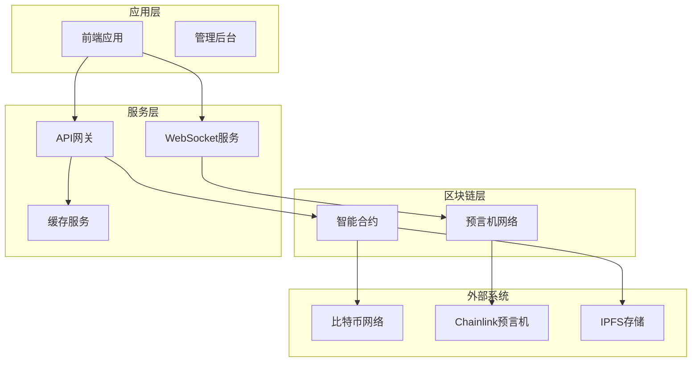
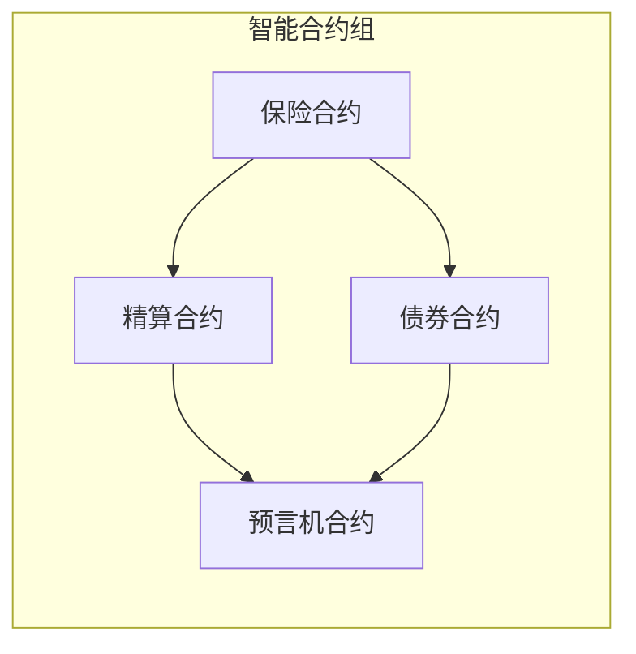
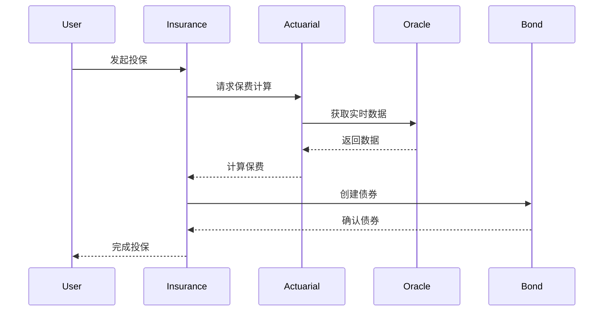
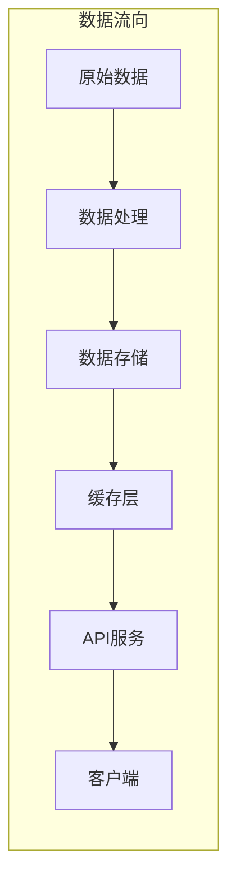
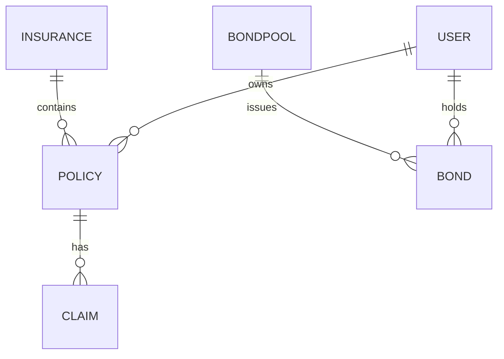
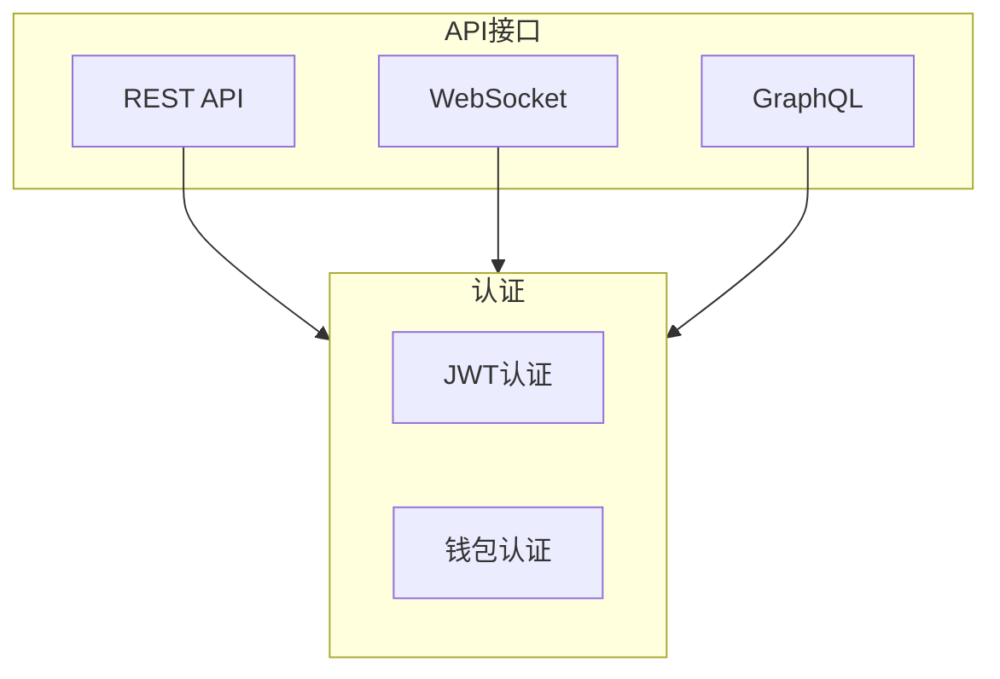
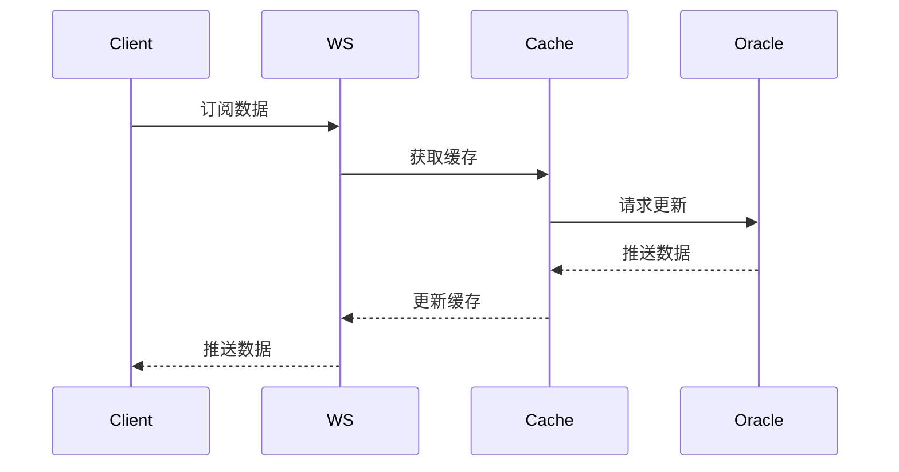
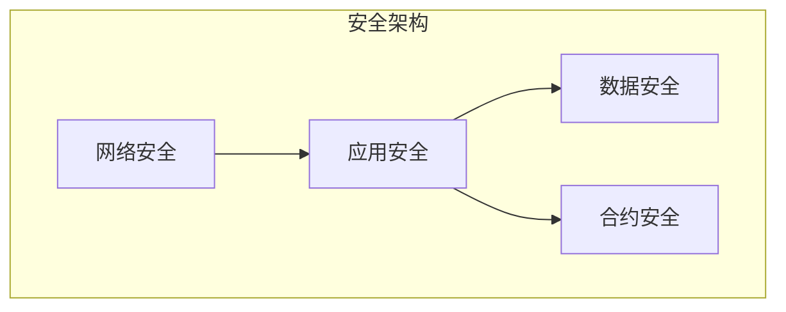
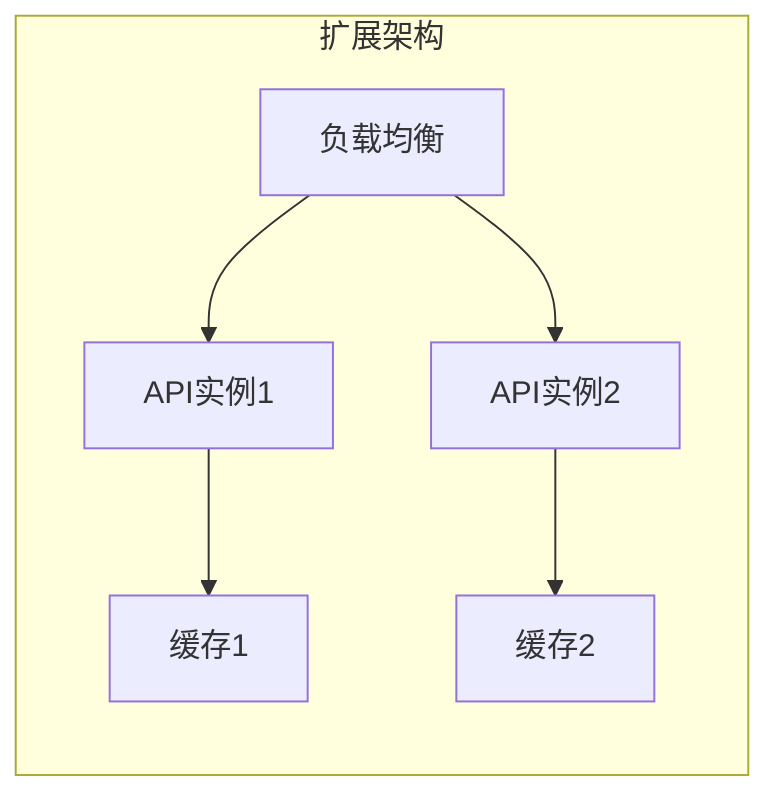

# HashCAT 系统架构设计文档
**Version: v1.0.0** | **Last Updated: 2024-03-22**

## 一、系统整体架构

### 1.1 系统架构图

### 1.2 技术栈选型
- **区块链层**：Sui Network
- **服务层**：Node.js + TypeScript
- **应用层**：React + TypeScript
- **存储层**：IPFS + MongoDB
- **消息队列**：Redis Pub/Sub
- **监控系统**：Prometheus + Grafana

## 二、区块链架构设计

### 2.1 Sui链特性利用
- **对象模型**：利用Sui的全局对象存储模型存储保险NFT
- **并行执行**：利用Sui的并行交易处理能力优化AMM操作
- **共享对象**：使用共享对象实现债券池的全局状态管理
- **时钟对象**：利用Sui Clock实现时间锁和赔付验证

### 2.2 智能合约架构

### 2.3 合约交互流程

## 三、数据流设计

### 3.1 核心数据流

### 3.2 数据模型

## 四、前后端交互设计

### 4.1 API设计

### 4.2 实时数据流

## 五、安全架构

### 5.1 安全层级

### 5.2 关键安全措施
- 多重签名机制
- 时间锁机制
- 预言机数据验证
- 合约升级控制
- 访问控制策略

## 六、扩展性设计

### 6.1 水平扩展

### 6.2 垂直扩展
- 合约优化
- 数据库分片
- 缓存策略
- 异步处理

## 七、监控告警

### 7.1 监控指标
- 合约调用频率
- 预言机延迟
- 系统响应时间
- 错误率统计
- 资源使用率

### 7.2 告警策略
- 多级告警阈值
- 告警聚合
- 自动恢复机制
- 人工介入流程 