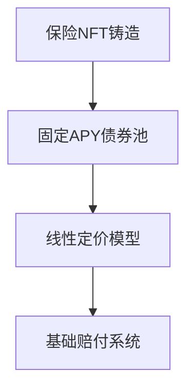

# HashCAT MVP 产品愿景文档
**Version: MVP-v1.0** | **Last Updated: 2024-03-22**

## 一、MVP 愿景

### 1.1 核心定位
HashCAT MVP 将专注于验证比特币算力波动风险管理的核心价值主张，通过最小化功能集展示产品的基本可行性和市场潜力。

### 1.2 价值主张
- **简单性**：线性风险定价模型
- **可用性**：基础投保和质押功能
- **可靠性**：分钟级赔付验证

## 二、MVP 目标用户

### 2.1 主要用户群
1. **比特币矿工**
   - 需求：基础风险对冲
   - 痛点：算力波动风险
   - 解决方案：简单保险产品

2. **流动性提供者**
   - 需求：固定收益
   - 痛点：收益不稳定
   - 解决方案：固定 APY 债券池

## 三、MVP 核心功能

### 3.1 必要功能

### 3.2 技术实现
1. **智能合约**
   - 简化版 NFT 合约
   - 基础质押功能
   - Chainlink 集成

2. **前端界面**
   - 基础数据展示
   - 钱包集成
   - 简单操作流程

## 四、成功指标

### 4.1 技术指标
- 合约部署成功
- 基础功能可用
- 交易确认 < 1分钟

### 4.2 用户指标
- 完整交易流程
- 基础功能可用
- 操作无阻塞

## 五、发展规划

### 5.1 MVP 阶段（5天）
- 核心合约开发
- 基础前端实现
- 简单产品演示

### 5.2 后续迭代
- 功能完善
- 性能优化
- 用户体验提升

## 六、风险控制

### 6.1 MVP 风险
1. **技术风险**
   - 合约安全性
   - 数据可靠性
   - 交易确认性

2. **应对策略**
   - 功能简化
   - 使用模拟数据
   - 基础错误处理 