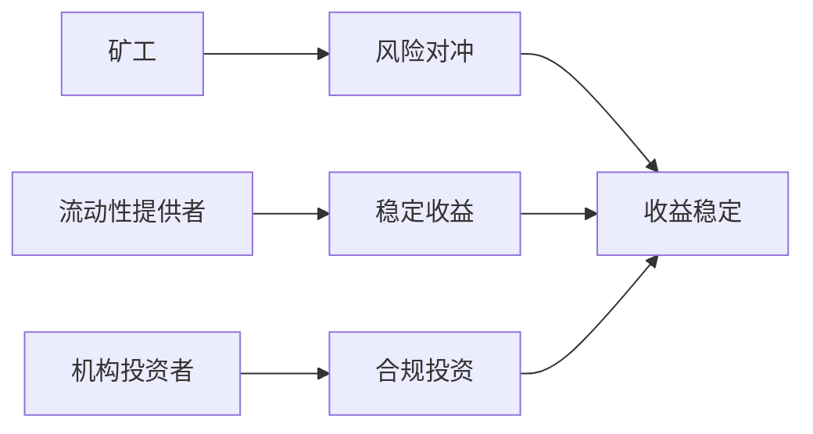
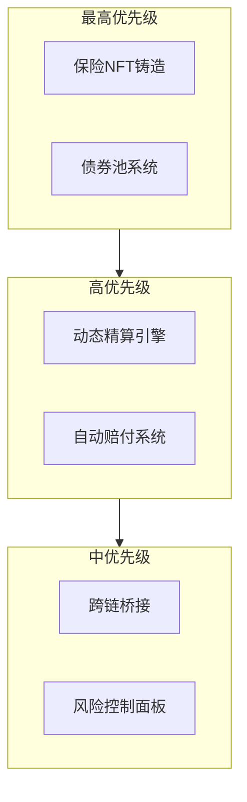

# HashCAT 产品愿景文档
**Version: v1.0.0** | **Last Updated: 2024-03-22**

## 一、产品愿景

### 1.1 愿景陈述
HashCAT致力于通过区块链技术革新比特币矿工的风险管理方式，打造全球首个基于算力波动的链上保险协议。我们通过动态精算模型和实时赔付机制，为矿工提供高效、透明、可验证的风险对冲解决方案。

### 1.2 核心价值
- **效率提升**：较传统保险产品效率提升300%
- **透明度**：所有数据上链，赔付过程可验证
- **实时性**：分钟级赔付验证系统
- **可组合性**：支持与其他DeFi协议集成

## 二、目标用户

### 2.1 主要用户群体
1. **比特币矿工**
   - 特征：拥有算力设备，关注收益稳定性
   - 痛点：算力波动带来的收益不确定性
   - 需求：风险对冲工具，稳定收益预期

2. **流动性提供者**
   - 特征：持有BTC，寻求稳定收益
   - 痛点：传统DeFi收益率波动大
   - 需求：稳定年化收益，低风险投资

3. **机构投资者**
   - 特征：资金规模大，风险承受能力高
   - 痛点：缺乏机构级风险管理工具
   - 需求：合规、可审计的投资方案

### 2.2 用户价值主张

## 三、MVP关键功能

### 3.1 核心功能优先级

### 3.2 功能依赖关系

## 四、区块链互动指标

### 4.1 链上指标
| 指标类别 | 目标值 | 监控频率 |
|----------|--------|----------|
| 活跃矿工数 | >100 | 每日 |
| TVL | >$5M | 实时 |
| 平均赔付时间 | <15分钟 | 实时 |
| 合约调用频率 | >1000/天 | 实时 |
| 预言机延迟 | <1分钟 | 实时 |

### 4.2 经济指标
| 指标类别 | 目标值 | 监控频率 |
|----------|--------|----------|
| 债券池APY | 8-12% | 每日 |
| 保费收入 | >$100K/月 | 每月 |
| 赔付率 | <5% | 每月 |
| 质押率 | >85% | 实时 |

## 五、成功标准

### 5.1 业务目标
1. **用户增长**
   - 首月活跃用户 >100
   - 月环比增长 >30%
   - 用户留存率 >80%

2. **交易规模**
   - 首月交易量 >$1M
   - 月环比增长 >50%
   - 平均保单金额 >$10K

3. **系统稳定性**
   - 系统可用性 >99.9%
   - 平均响应时间 <300ms
   - 错误率 <0.1%

### 5.2 技术目标
1. **合约性能**
   - 交易确认时间 <3秒
   - Gas费用优化 >30%
   - 合约升级成功率 100%

2. **预言机可靠性**
   - 数据准确率 >99.9%
   - 更新延迟 <1分钟
   - 节点可用性 >99.9%

## 六、风险与机遇

### 6.1 主要风险
1. **市场风险**
   - 比特币价格剧烈波动
   - 算力市场变化
   - 监管政策变动

2. **技术风险**
   - 智能合约漏洞
   - 预言机数据延迟
   - 跨链桥安全

### 6.2 发展机遇
1. **市场机遇**
   - DeFi保险市场空白
   - 机构投资者入场
   - 跨链生态发展

2. **技术机遇**
   - Sui链性能优势
   - 预言机技术成熟
   - 跨链技术突破

## 七、发展路线

### 7.1 短期目标（3个月）
- 完成MVP核心功能
- 建立基础用户群
- 实现稳定运营

### 7.2 中期目标（6个月）
- 扩展产品功能
- 优化用户体验
- 扩大市场覆盖

### 7.3 长期目标（12个月）
- 建立完整生态
- 实现规模效应
- 打造行业标准 